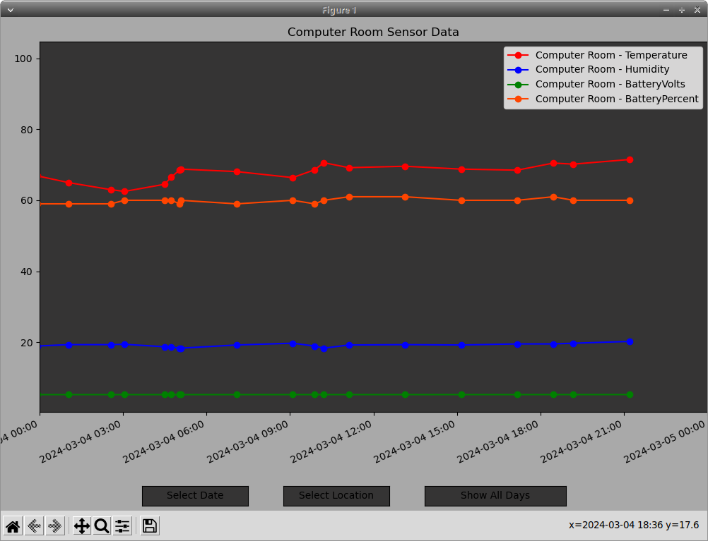

# Shelly-HT-G3-MQTT
Display (in the terminal) and locally store data (in a csv file) from the Shelly H&amp;T G3 sensors. Also includes a chart to display your stored data.    
The stored data includes Temperature, Humidity, Battery Volts and Battery Percent.    

    
    
    
To install make sure you have the additional modules installed    
`pip install pandas numpy matplotlib paho-mqtt`    
`git clone https://github.com/optio50/Shelly-HT-G3-MQTT`    
`cd Shelly-HT-G3-MQTT`    
`chmod +x HT-Chart.py`    
`chmod +x HT-MQTT.py`    
Rename the csv file to start your own (I have included mine so you can test the chart tool)    
`mv HT-sensor-log.csv HT-sensor-log-old.csv`   
`./HT-MQTT.py` to start viewing and recording data.    
You can run the script from the terminal or a cron job / startup routine.    
The H&T only comes online every so often.    
The values only update after it transmits a Full Status Notification. (Threshold met or 2 hours)    
You can hook up an external power supply to increase the transmit frequency to 5 min.    
Values will be empty until an update has been triggered.    
You can manually trigger an update by single pressing the reset button.    

    
🠉   reading is increasing from last update    
🠋   reading is decreasing from last update    
🠈🠊 reading is the same as last update    
    
    

You need an MQTT broker to send your data to. This script only retrieves the data from the broker. The broker can be on your local machine.    
Each H&T must be setup to sent the data to the broker. Edit the HT-MQTT.py file and make the noted changes.    
